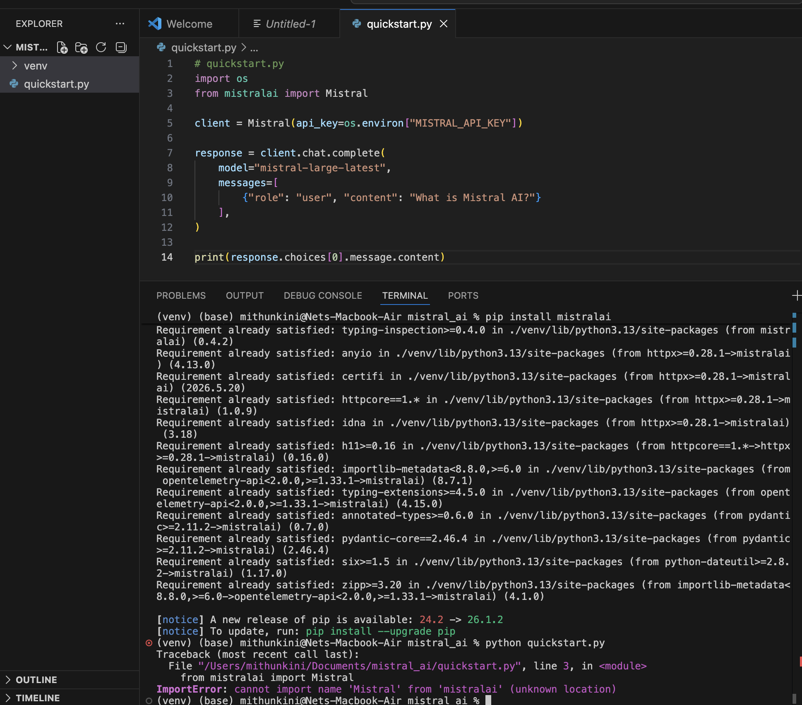

import { BeforeAfterExplorer } from "@site/src/components/mistralBusinessCase/exercise1/DocAuditReport";

# The Redesigned docs.mistral.ai

This is the deliverable: the proposed documentation portal with every change from the critique incorporated. The reasoning behind each decision is in the [Design Rationale](./). Here, the annotations carry the argument — **every line in the tree below is a cut, a move, a rename, a new page, or a deliberate keep, and the note says why.**

Two things to read the annotations against:

- **`[SURFACED]` / `[MOVED]`** = content that already exists and is being relocated to where its reader looks. Near-zero writing cost.
- **`← NEW`** = genuinely new content, tiered by urgency at the bottom of this page.
- **`← RENAMED`** = same page, new label. Every rename is traced to a named rule in [The naming system](#the-naming-system) below the tree.

---

## The top navigation

```
BEFORE:  Getting Started | Models | Products | Developers | Admin | API
AFTER:   Getting Started | Models | Vibe | Studio & API | Deploy | Production | Admin
```

- **Products → dissolved.** A container page that linked to Vibe and Studio — which the homepage cards already do. Pure redundancy (finding D-07).
- **Developers → dissolved.** Its content (SDKs, error reference, migration guides, cookbooks) absorbs into **Studio & API → Resources**, where a developer building on the API would actually look.
- **API → demoted** from a top tab to a link inside Studio & API → Resources.
- **Vibe** and **Studio & API** → surfaced from inside the old Products container to the top level.
- **Deploy** and **Production** → two new top-level sections. Not additions for their own sake: they are the only way to give the Enterprise Buyer and the Production Operator a first-class home instead of burying their content three levels deep inside Models or Admin.

---

## The full information architecture

```
docs.mistral.ai (proposed)

├── Getting Started                                  [~23 → ~15 pages]
│   ├── Platform overview                            [KEEP]
│   ├── Why Mistral ← NEW                           [M-08: open weight, EU sovereignty, Apache 2.0, on-prem;
│   │                                                 2-min read for the Evaluator; answers "why Mistral over OpenAI"]
│   └── Quickstarts
│       ├── Vibe Work
│       │   ├── Run your first task                  [KEEP]
│       │   ├── Analyze a dataset                    [KEEP]
│       │   └── Create your first Skill              [KEEP]
│       ├── Vibe Code
│       │   ├── Install the Vibe CLI                 [KEEP]
│       │   └── Scaffold a project                   [KEEP]
│       ├── Studio (4 → 3 pages)
│       │   ├── Test a model in the playground       [KEEP]
│       │   ├── Create a reusable Prompt             [KEEP]
│       │   └── Create a Skill in Studio             [KEEP]
│       │   ~~Activate Studio & generate key~~       [D-10: MERGE as Step 0 of Developer quickstart]
│       ├── Developer
│       │   ├── Send your first API request          [FIX (F-09, Critical): sample errors as printed — make it the
│       │   │                                          canonical, CI-tested source of truth; reconcile with SDKs page.
│       │   │                                          ADD (F-10): "Step 0" environment setup (absorbs D-10) +
│       │   │                                          downloadable venv-ready scaffold zip]
│       │   ├── Build an agent with tools            [KEEP]
│       │   ├── RAG with document search             [KEEP]
│       │   └── Build a workflow                     [KEEP]
│       └── Admin
│           ├── Create your organization             [KEEP]
│           ├── Configure SSO                        [KEEP]
│           └── Manage workspaces                    [KEEP]
│   ~~Platform overview (old slug)~~                [D-01: REDIRECT → /getting-started/platform-overview]
│   ~~SDK Clients (old slug)~~                      [D-02: REDIRECT → Studio & API → Resources → SDKs]
│   ~~Le Chat quickstarts (×3)~~                    [D-03: REDIRECT each → Vibe Work equivalent]
│   ~~Le Chat overview~~                            [D-04: REDIRECT → /vibe/overview]
│   ~~Le Chat Vibe Code workflow~~                  [D-05: REDIRECT → /vibe/code/overview]
│   ~~Quickstarts landing page~~                    [D-08: MERGE routing into Platform overview]
│   ~~Mistral Vibe quickstart landing~~             [D-09: REDIRECT — no clear purpose, orphaned]
│   Glossary                                         [KEEP]
│
├── Models                                           [RESTRUCTURED]
│   ├── All models  ← RENAMED (was "Overview")       [REWRITTEN: 6 active models only; 45-row deprecated table removed
│   │                                                 inline; Devstral 2 content bug fixed — it currently appears as
│   │                                                 both Featured and Deprecated with identical version 25.12]
│   ├── Decision guide                               [REWRITE of /models/model-selection-guide (D-06/M-01):
│   │                                                 use case → model → price → API string, use-case-first —
│   │                                                 the page has comparison data but no decision workflow]
│   ├── Migration guide                              [SURFACED from /resources/migration-guides:
│   │                                                 OpenAI + self-hosted Llama with working code;
│   │                                                 content complete — fix is findability, not authorship]
│   ├── Model version pinning ← NEW                 [M-10: -latest vs. versioned strings, deprecation policy,
│   │                                                 when to pin; cross-linked from Production]
│   ├── Prompting & tuning  ← RENAMED (was "Best Practices")
│   │   ├── Prompting                                [KEEP; ABSORBS the duplicate at Studio → Model capabilities → Prompting
│   │   │                                             (D-12: same ground covered twice — merge, redirect one)]
│   │   └── Sampling                                 [KEEP]
│   └── Legacy models                               [MOVED from Overview: the full 45-row deprecated table;
│                                                     one extra click for the rare reader who needs it]
│   ~~Labs~~                                        [DOWNGRADED to a footnote on Overview — low-traffic, not nav-worthy]
│   ~~Cloud deployments~~                           [MOVED to Deploy — a deployment concept, not a models concept]
│   ~~Self-deployment~~                             [MOVED to Deploy — same reason]
│
├── Vibe                                             [SURFACED from Products; UNCHANGED — best-organised section]
│   ├── Vibe overview  ← RENAMED (was "Overview")     [KEEP; strengthen the Le Chat → Vibe rename note]
│   ├── Le Chat → Vibe migration ← NEW              [M-11: feature-by-feature map (old name → new location),
│   │                                                 history reassurance; resolves the rename confusion]
│   ├── Data privacy ← NEW                          [M-20: direct, linkable answer — "is my data used to train?";
│   │                                                 cross-link from Admin → Privacy]
│   ├── Work (14 pages)                              [ALL KEPT — every page maps to a real workflow]
│   ├── Chat (legacy, 5 pages)                       [ALL KEPT — clearly archived, not deleted]
│   └── Code
│       ├── Overview / Choose surface / Safety       [KEEP]
│       ├── Context management ← NEW                 [M-15: which files Vibe Code reads, how to scope it;
│       │                                             a differentiator vs. Cursor and Claude Code]
│       ├── CLI (Install, Skills)                    [KEEP]
│       ├── VS Code extension                        [KEEP]
│       └── Vibe Code Web (Get started, Security)    [KEEP]
│
├── Studio & API                                     [CONSOLIDATED: current Studio + Developers/Resources]
│   ├── Studio & API overview  ← RENAMED             [KEEP; fix duplicate meta description shared with Vibe overview
│   │                                                 (O-10: both read "Documentation for the deployment and usage…")]
│   ├── Model capabilities  ← RENAMED (was "Conversations")
│   │   ├── Chat Completions                         [KEEP]
│   │   ├── Streaming ← NEW                         [M-12: standalone SSE guide; currently only a code tab
│   │   │                                             buried inside Chat Completions]
│   │   ├── Vision / Reasoning / Citations           [KEEP]
│   │   ├── Function Calling / Structured Outputs     [KEEP]
│   │   └── Moderation & Guardrailing                [KEEP]
│   │   ~~Prompting (under Model capabilities)~~     [D-12: MERGE into Models → Prompting & tuning]
│   ├── Agents (Introduction, Agents API, Tools×4, Handoffs)   [KEEP]
│   ├── Knowledge & RAG                              [LABEL FIX (O-02): standardise — some pages read
│   │   ├── Libraries / Data connectors (for RAG)    "RAG & Embeddings" for the same section]
│   │   ├── Embeddings / RAG Quickstart              [KEEP]
│   ├── Document AI                                  [KEEP — slugs are /basic_ocr and /document_qna (O-09)]
│   ├── Search Toolkit (Vespa sub-tree, ~9 pages)    [KEEP — deep, but serves a real audience]
│   ├── Audio                                        [KEEP]
│   ├── Workflows (~30 pages, 4 sub-sections)        [KEEP — deepest section on the site; its
│   │                                                 "Managing Workflows in Production" sub-tree cross-links
│   │                                                 to the new Production section]
│   ├── Observability                                [KEEP; cross-link with Resources → Observability integrations]
│   ├── Batch Processing / Moderation                [KEEP]
│   └── Resources                                    [ABSORBED from the old Developers top-nav]
│       ├── API Reference                            [KEEP — /api; no longer a standalone top tab]
│       ├── SDKs / Cookbooks / Known limitations      [KEEP]
│       ├── Error reference                          [SURFACED + RENAMED from "Error glossary": HTTP codes,
│       │                                             error schema, working retry sample already exist here;
│       │                                             "glossary" undersold it — rename to "Error reference"]
│       ├── Security advisories / Supported languages  [KEEP; advisories cross-link ← Deploy → Security]
│       ├── Changelog / Deprecated features (×3)       [KEEP]
│       └── Model registry ← NEW                    [M-19: structured page + JSON endpoint — model string,
│                                                     status, capabilities, successor; machine-readable for agents]
│       ~~Migration guides~~                         [MOVED: primary home is Models → Migration guide; this redirects]
│       ~~Ambassadors~~                              [D-11: OUT of docs sidebar — community programme, not docs]
│
├── Deploy ← NEW TOP-LEVEL SECTION                  [enterprise-critical content, currently scattered or absent]
│   ├── Deployment options ← NEW                    [cloud / hybrid / self-hosted, written for the non-technical
│   │                                                 Enterprise Buyer, not the developer]
│   ├── Cloud deployment                            [MOVED from /models/deployment/cloud-deployments]
│   ├── Self-hosted deployment                      [MOVED from /models/deployment/local-deployment]
│   ├── Architecture ← NEW                          [M-06: network topology + data-flow diagrams, SE-shareable
│   │                                                 without NDA risk; today SEs build their own decks from blogs]
│   ├── Compliance ← NEW                            [M-05: SOC 2 dates, GDPR, EU AI Act mapping, DPA link;
│   │                                                 expands the one-sentence fragment buried in Known Limitations]
│   ├── Security architecture ← NEW                [M-13: encryption at rest/in transit; prose for the Buyer]
│   └── Solution blueprints ← NEW                  [M-17: product → model → deployment → pricing → sample;
│                                                     the SE pulls this up on a live customer call]
│
├── Production ← NEW TOP-LEVEL SECTION             [first-class home for the most underserved segment]
│   ├── Going to production ← NEW                  [M-02: pre-launch checklist — rate limits, retries, pinning,
│   │                                                 cost, security; closes the quickstart-to-production gap]
│   ├── Error handling & retry                     [SURFACED from /resources/error-glossary — content complete]
│   ├── Rate limits                                 [SURFACED from Admin → tier — content complete; stays cross-linked]
│   ├── Model pinning                               [CROSS-LINK → Models → Model version pinning]
│   ├── Cost estimation ← NEW                      [M-14: token counting, batch vs. real-time, cost per model]
│   ├── Latency debugging ← NEW                    [M-16: checklist — model, prompt length, streaming, region]
│   └── Deprecation guide ← NEW                   [old model → new model → code changes → timeline]
│
└── Admin                                           [COMPETENT — targeted improvements only]
    ├── Security & Access
    │   ├── Admin Panel / Orgs & Workspaces          [KEEP]
    │   ├── Connector access & governance            [RENAMED from "Manage Connectors"; confirmed in v2 inventory]
    │   ├── SSO                                      [EXPAND: add Okta + Azure AD specifics; current is generic SAML]
    │   ├── Email domain auth / API keys             [KEEP]
    │   ├── Audit logs                               [EXPAND: what is logged + retained, for SOC 2 evidence]
    │   ├── Admin API                                [KEEP]
    │   └── Privacy                                  [KEEP; cross-link ← Vibe → Data privacy]
    └── User Management & FinOps
        ├── User management / Subscriptions / Billing  [KEEP]
        ├── Rate limits and usage tiers              [KEEP; cross-link ← Production → Rate limits]
        └── Usage limits                             [KEEP]
```

> **Not drawn as separate nodes above, to keep the tree legible:** every top-level section also carries a **FAQ** — see [Category FAQs](#category-faqs) below. In retrieval it is the single highest-value content type, so it is part of the structure, not an afterthought.

---

## The naming system

Every rename above is produced by one rule, applied in a fixed priority order. The rules are named and sourced; where two collide, the higher-priority rule wins and I say which and why. Nothing here rests on "best practice."

**The rule stack, highest priority first:**

1. **Jakob's Law of the Web** (Nielsen, 2000) — users spend most of their time on *other* sites, so conform to the vocabulary they already know. Established API terms are never renamed for novelty: `API Reference`, `Changelog`, `SDKs`, `Glossary`, `Chat Completions`, `Function Calling`, `Structured Outputs`, `Embeddings` stay exactly as they are.
2. **ANSI/NISO Z39.19-2005** (the US standard for controlled vocabularies) — enforce one *preferred term* per concept (§6.2, synonym control), and disambiguate *homographs* with parenthetical qualifiers (§6.3.2). This is what fixes both "Overview × 4" and "Connectors × 4."
3. **Diátaxis** (Daniele Procida) — grammar follows content type: how-to and tutorial pages take an **imperative verb**; reference and explanation pages take a **noun phrase**. This is *why* "Configure SSO" (task) and "Structured Outputs" (reference) are both correct in the same tree — they are different Diátaxis modes, not an inconsistency.
4. **Information Foraging Theory — "information scent"** (Pirolli & Card, Xerox PARC, 1999) — a label must predict its destination strongly enough to prevent *pogo-sticking* (clicking in and bouncing back). This is what condemns "Overview": zero scent.
5. **Basic-level categories** (Rosch, 1978, prototype theory of categorization) — a container's label must sit at the level of abstraction its members share. "Conversations" is below the basic level for a group that also contains Vision and Moderation → "Model capabilities."
6. **The curse of knowledge** (Camerer, Loewenstein & Weber, 1989) — experts label from their own mental model. Replace product-team coinages with the reader's term.
7. **Front-loading** (NN/g eyetracking; F-pattern reading) — the information-carrying word goes first; sentence case, per the Google developer-documentation style guide.

**Every rename, traced to the rule that forces it:**

| Before | After | Rule that forces it | Why |
|---|---|---|---|
| Overview *(Models)* | **All models** | IFT scent + Z39.19 §6.2 | "Overview" carries no scent and isn't a unique preferred term (it repeated 4×); "All models" predicts the page |
| Overview *(Studio & API)* | **Studio & API overview** | Z39.19 §6.3.2 | homograph qualifier makes it a unique preferred term |
| Overview *(Vibe)* | **Vibe overview** | Z39.19 §6.3.2 | same disambiguation |
| Overview *(Deploy)* | **Deployment options** | IFT scent + curse of knowledge | the page's *job* is choosing cloud / hybrid / self-hosted — name the decision, not the page type |
| Conversations *(Studio section)* | **Model capabilities** | Rosch basic-level + curse of knowledge | a container must describe its members; Vision and Moderation aren't "conversations," and the term is internal jargon |
| Best Practices *(Models section)* | **Prompting & tuning** | IFT scent | "best practices" is contentless; name what's actually inside (Prompting, Sampling) |
| Error glossary | **Error reference** | Z39.19 §6.2 + Diátaxis | the content is a status-code *reference*, not a glossary of terms; the label must match the Diátaxis mode |
| Connectors *(Studio, Knowledge & RAG)* | **Data connectors (for RAG)** | Z39.19 §6.3.2 | qualifier separates it from the Vibe / Admin / Workflow senses |
| Manage Connectors *(Admin)* | **Connector access & governance** | Z39.19 §6.3.2 + IFT | disambiguates the homograph and names the admin's actual job |

**Synonym control (Z39.19 §6.2).** The same RAG section renders as both "Knowledge & RAG" and "RAG & Embeddings" (inventory finding O-02). A controlled vocabulary permits exactly one preferred term. Preferred: **Knowledge & RAG** (broader — it also covers Libraries and Connectors, which "Embeddings" excludes). "RAG & Embeddings" becomes a non-preferred synonym that redirects.

**Deliberately NOT renamed — Jakob's Law outranks every rule below it:**

| Kept term | Why it's frozen |
|---|---|
| API Reference · Changelog · SDKs · Glossary | Cross-site conventions; renaming raises the learning cost for zero gain (Jakob's Law) |
| Chat Completions · Function Calling · Structured Outputs · Vision · Embeddings | Industry-established preferred terms (Jakob's Law + Z39.19) *and* the canonical strings AI agents search for (Design Rationale, Stage 5). "Get reliable JSON output" would break the term Vibe Code retrieves on |
| Getting Started | Near-universal navigation convention (Jakob's Law) |

**One conflict, resolved in the open — "Production" vs "Operate."** Diátaxis (the section is how-to → imperative verb) and parallelism with the sibling verb "Deploy" both argue for renaming it **Operate**. Jakob's Law and information scent argue to keep **Production** — the segment it serves is literally the *Production Operator*, and "production" is the word they already search. Jakob's Law sits above Diátaxis in the stack, so **Production stays.** The rule order made the call, not taste.

**What was already correct, and therefore untouched.** The Getting-Started quickstarts and Vibe Work were already imperative-first and Diátaxis-correct: "Run your first task," "Connect tools with Connectors," "Configure SSO," "Send your first API request." Validated against the rule stack, not changed. Recognising what not to rename is the same discipline as renaming — a controlled vocabulary is judged by its consistency, not its churn.

---

## What moved vs. what's genuinely new

The distinction that changes the effort estimate — and the credibility of a "shippable in weeks" claim.

**Zero new writing — the fix is findability** (surface or move existing, complete content):

| Content | Currently at | Belongs at |
|---|---|---|
| Migration guide (OpenAI + Llama) | `/resources/migration-guides` | Models → Migration guide |
| Error handling & retry | `/resources/error-glossary` | Production → Error handling |
| Rate limits | `/admin/…/tier` | Production → Rate limits (kept in Admin too) |
| Cloud + Self-hosted deployment | `/models/deployment/*` | Deploy section |

**Genuinely new writing, tiered by urgency:**

- **Tier 1 — write first (critical audience gaps):** Going to production (M-02) · Compliance (M-05) · Deployment architecture (M-06) · Decision guide rewrite (M-01) · Why Mistral (M-08)
- **Tier 2 — write next (high commercial value):** Security architecture (M-13) · Solution blueprints (M-17) · Model pinning (M-10) · Le Chat → Vibe migration (M-11) · Streaming (M-12) · Cost estimation (M-14) · Latency debugging (M-16) · Deprecation guide · Vibe Code context management (M-15) · Vibe data privacy (M-20)
- **Tier 3 — valuable, lower urgency:** Machine-readable model registry (M-19) · SE demo recipes (M-18)

---

## One design decision worth defending: Connectors in four places

Connectors appear in four locations — Vibe Work, Studio Knowledge & RAG, Admin, and inside Workflows. That looks like a bug. It isn't. Each instance serves a different audience doing a different job: the Vibe user connecting Google Drive, the developer wiring data sources for RAG, the Admin governing connector access org-wide, the developer using connectors inside a Workflow. Collapsing them into one page would serve none of them well. **The fix is consistent naming across all four and explicit cross-links between them — not consolidation.** Knowing when *not* to merge is as much a part of IA as knowing when to cut.

---

## Category FAQs

**A short FAQ in every top-level section, each question phrased exactly as the reader would type it — the one content pattern I'd mandate site-wide.** The reasoning is empirical, not stylistic (see [Design Rationale → Stage 5](./#stage-5-designing-for-readers-who-arent-human)): in the support-bot knowledge layer I built, FAQs were the most-retrieved and most-cited content by a wide margin, because a question-shaped query matches a question-shaped entry where a declarative reference passage does not — the vocabulary-mismatch problem (Furnas et al., 1987).

The questions don't need inventing — they're the "core question" column of the Stage 2 workflow tables, verbatim:

| Section | FAQ entries, in the reader's own words |
|---|---|
| Getting Started | "Why does `from mistralai import Mistral` throw an error?" · "Do I need a virtualenv to run the quickstart?" · "Where do I put my API key?" |
| Models | "Which model is cheapest at high volume?" · "Why is Mistral Large priced *below* Mistral Medium?" · "What's the difference between `-latest` and a dated model string?" · "Which model replaces GPT-4o?" |
| Studio & API | "How do I get reliable JSON output?" · "How do I stream responses to my UI?" · "What does a `422` error mean?" |
| Deploy | "Does our data leave our infrastructure?" · "Is Mistral SOC 2 / GDPR / EU AI Act compliant?" · "Can this run fully air-gapped?" · "Where is the DPA?" |
| Production | "How should I handle `429`s in production?" · "Why is my bill higher than expected?" · "A model I depend on is being deprecated — what do I do?" |
| Vibe | "I was using Le Chat — where did my conversations go?" · "Is my data used to train models?" |
| Admin | "How do I set up SAML SSO with Okta?" · "What audit logs are available for SOC 2 evidence?" |

**How they ship — so this is retrieval infrastructure, not decoration:**

- **`schema.org/FAQPage` markup** on every block — eligibility for Google's "People Also Ask" and rich results.
- **Included in `llms.txt` and the per-page Markdown export** — Vibe Code and other agents retrieve the Q&A pair directly (ties to finding F-06).
- **Seeded from real support tickets and zero-result site searches, and kept current from the same two sources** — so the FAQ tracks what readers actually ask, not what the team assumes they ask. (Several entries above are already earned: the import question is F-09, the pricing-inversion question is a confirmed inventory finding, the Le Chat question is edge-case #3 from the audience analysis.)

An FAQ entry is not a place to restate a page — it is the question-shaped front door that routes a reader, human or agent, to the page that answers them.

---

## What it costs

One extra click to reach deprecated model history. One extra click for anyone who bookmarked a Le Chat quickstart. API Reference moves from a top tab to Studio & API → Resources. Labs content becomes a footnote. **That is the complete list of things a current reader loses** — and nothing is deleted from the web; every cut page becomes a redirect.

---

## The Critical fix, verified by execution (F-09)

Every other exhibit on this page is a structural proposal. This one is a defect you can reproduce in two minutes — the only finding I confirmed by *running the code*, not reading the page.

**What the quickstart ships today** — `/getting-started/quickstarts/developer/first-api-request`, the proof-of-life page:

```python
# quickstart.py — exactly as printed on the page
import os
from mistralai import Mistral          # ← raises an error on run

client = Mistral(api_key=os.environ["MISTRAL_API_KEY"])

response = client.chat.complete(
    model="mistral-large-latest",
    messages=[{"role": "user", "content": "What is Mistral AI?"}],
)
print(response.choices[0].message.content)
```

**Run it — verified, not asserted.** With the SDK already installed (the terminal shows `pip install mistralai` → "Requirement already satisfied"), the documented import throws on line 3:



```
Traceback (most recent call last):
  File ".../quickstart.py", line 3, in <module>
    from mistralai import Mistral
ImportError: cannot import name 'Mistral' from 'mistralai' (unknown location)
```

The package is present; the *import line the page prints* is what's wrong — which rules out "you forgot to install it" and pins the defect squarely on the doc, on the highest-stakes page on the site.

**What actually executed** — the import form already documented on the SDKs page, i.e. the site contradicts itself:

```python
import os
from mistralai.client import Mistral   # ← the import that resolves

os.environ["MISTRAL_API_KEY"] = "YOUR_MISTRAL_API_KEY"   # testing only — see below
api_key = os.environ.get("MISTRAL_API_KEY")

client = Mistral()
response = client.chat.complete(
    model="mistral-small-latest",
    messages=[{"role": "user", "content": "Explain the concept of an API in one simple sentence."}],
)
print(response.choices[0].message.content)
```

The only load-bearing difference is line 2 — `from mistralai import Mistral` versus `from mistralai.client import Mistral`. One line, on the highest-traffic page on the site, is the difference between an evaluator seeing a response and an evaluator seeing a stack trace. It doesn't matter which import is *canonically* correct; what matters is that two pages disagree and the one a first-timer hits first is the one that fails.

**How it should ship** — one canonical sample, the F-10 environment setup folded in as Step 0, the key read from the environment rather than hard-coded, and a CI doctest so it can never regress:

```python
# Step 0 — set up your environment (the piece the current page omits entirely):
#   python -m venv .venv && source .venv/bin/activate
#   pip install mistralai
#   export MISTRAL_API_KEY="sk-..."     # set it in the shell; don't hard-code it in the file

import os
from mistralai.client import Mistral

client = Mistral()                       # reads MISTRAL_API_KEY from the environment
response = client.chat.complete(
    model="mistral-small-latest",
    messages=[{"role": "user", "content": "What is Mistral AI?"}],
)
print(response.choices[0].message.content)
```

Ship this exact block as a downloadable scaffold (venv-ready project + `.env` template + `requirements.txt`), and wire the snippet into CI so the build fails the moment the import breaks again. A quickstart is the one page that must be executable, not just readable.

---

## The rewrite in practice: one question, two readers

The IA is the skeleton. This is what the rewrite does to an actual page. The test for whether documentation truly understands its audience: take one real question — *"Which model should I use, and how do I deploy it?"* — and answer it for two different readers. If the two answers look the same with the nouns swapped, the docs don't have an audience model. Below is the same underlying content, rewritten for each.

<BeforeAfterExplorer />
