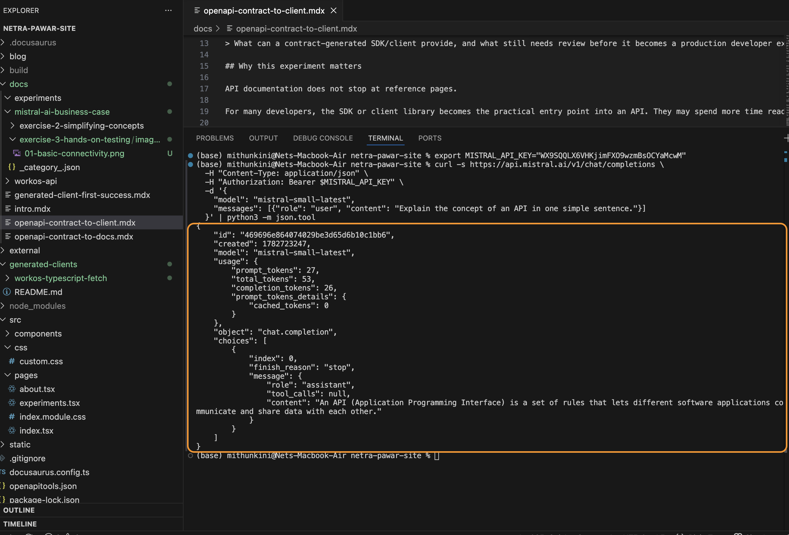

# Send Your First API Request

Now that your environment is configured, let's make your first request to the Mistral API. 

We will use `curl` for this first call. Using `curl` allows you to see the exact HTTP headers and JSON payload being sent to the server, which is crucial for debugging later.

## The Quick Win (30 Seconds)

Copy the following command and paste it into your terminal. 

This command assumes you have already set the `MISTRAL_API_KEY` environment variable in the previous step.

```bash
curl -X POST https://api.mistral.ai/v1/chat/completions \
  -H "Content-Type: application/json" \
  -H "Authorization: Bearer $MISTRAL_API_KEY" \
  -d '{
    "model": "mistral-small-latest",
    "messages": [
      {
        "role": "user",
        "content": "Explain the concept of an API in one simple sentence."
      }
    ]
  }'
```

Hit **Enter**. Within a few seconds, you should see a JSON response returned in your terminal.


*(Screenshot: Expected output from the curl command above)*

> **⚠️ Caveat: Terminal Output**
> Because this command uses your real API key, be careful if you are screen-sharing or recording a tutorial. The `echo $MISTRAL_API_KEY` command from the previous step will expose your key in the terminal history.

## What You Just Sent (Request Breakdown)

Let's break down the anatomy of the request you just made. Every Mistral API call consists of three parts: the endpoint, the headers, and the body.

### 1. The Endpoint
`POST https://api.mistral.ai/v1/chat/completions`

This is the URL where Mistral's servers listen for chat requests. The `POST` method indicates that you are sending data to the server to be processed.

### 2. The Headers
Headers are metadata sent alongside your request.
- `Content-Type: application/json`: Tells Mistral that the data you are sending (the body) is formatted as JSON.
- `Authorization: Bearer $MISTRAL_API_KEY`: This is how Mistral knows it's you. The `Bearer` prefix is a standard HTTP authentication scheme. If this header is missing or incorrect, the server will reject the request with a `401 Unauthorized` error.

### 3. The Body Schema
The `-d` flag in curl stands for "data." This is the actual JSON payload you sent:

```json
{
  "model": "mistral-small-latest",
  "messages": [
    {
      "role": "user",
      "content": "Explain the concept of an API in one simple sentence."
    }
  ]
}
```

- **`model` (Required):** Specifies which LLM should process the request. We used `mistral-small-latest` because it is fast and cost-effective for simple tasks.
- **`messages` (Required):** An array of message objects representing the conversation history.

### The Messages Format

The `messages` array is the core of the Chat Completions API. It uses "roles" to differentiate who is speaking.

| Role | Who is speaking | Purpose | Required? |
|------|-----------------|---------|-----------|
| `system` | You (the developer) | Sets the behavior, persona, or constraints for the model. | No |
| `user` | The end user | The actual prompt or question. | Yes (at least one) |
| `assistant` | The model | Previous responses. Used to maintain context in a multi-turn conversation. | No |

**Example: Adding a System Message**

If we wanted the model to answer like a pirate, we would add a `system` message to the beginning of the array:

```json
"messages": [
  {
    "role": "system",
    "content": "You are a pirate. Always respond in pirate slang."
  },
  {
    "role": "user",
    "content": "Explain the concept of an API in one simple sentence."
  }
]
```

> **⚠️ Caveat: Message Order**
> The order of messages matters. If you include a `system` message, it must be the first item in the array. The `user` and `assistant` messages should alternate chronologically after that.

---

**Next Step:** You've successfully sent a request. Now, let's look at [What You Got Back](./03-understand-response.mdx) to understand how to parse the model's answer.
