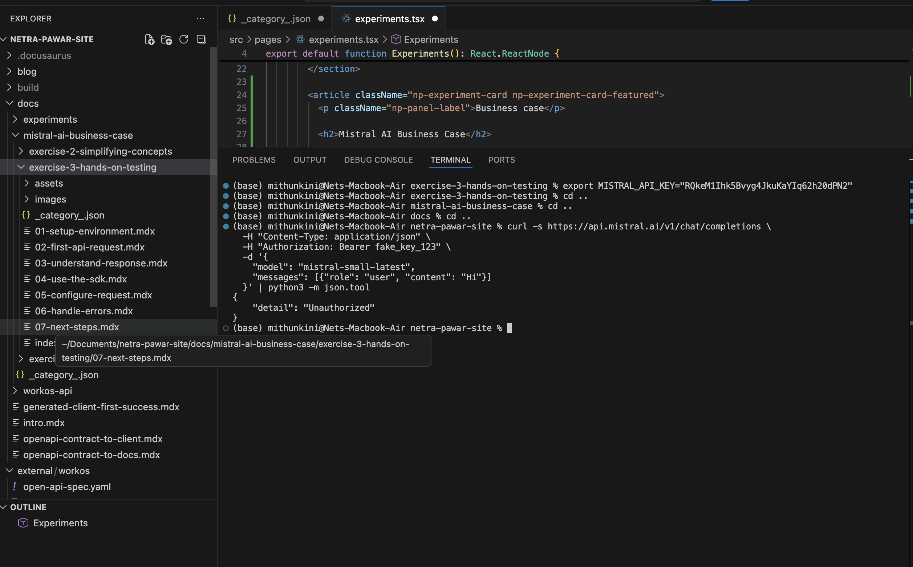
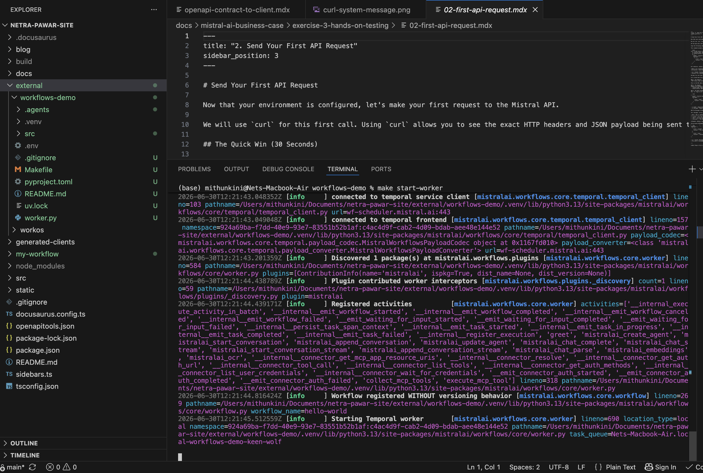
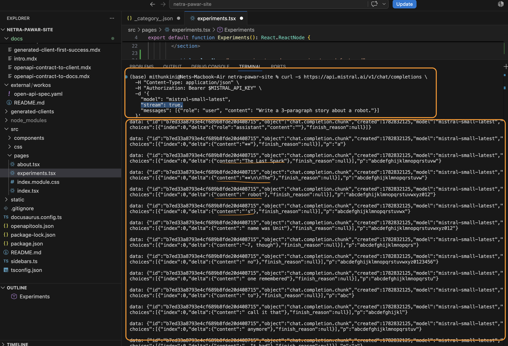

# Use the SDK

While `curl` is excellent for understanding the raw HTTP mechanics, you shouldn't use it in production code. 

Instead, you should use Mistral's official SDKs. The SDKs automatically handle:
- Injecting the `Authorization` header
- Serializing your data into JSON
- Parsing the response back into native language objects
- Managing network timeouts and retries

Let's recreate the exact same request we made earlier, but using Python and TypeScript.

## Python SDK

### 1. Install the SDK
```bash
pip install mistralai
```

### 2. Write the Code
Create a file named `chat.py` and add the following code. The SDK will automatically look for the `MISTRAL_API_KEY` environment variable you set in Step 1.

```python
import os
from mistralai import Mistral

# Initialize the client. It automatically picks up MISTRAL_API_KEY from the environment.
client = Mistral()

# Make the request
response = client.chat.complete(
    model="mistral-small-latest",
    messages=[
        {
            "role": "user",
            "content": "Explain the concept of an API in one simple sentence."
        }
    ]
)

# Extract and print the content
print(response.choices[0].message.content)
```

### 3. Run It
```bash
python chat.py
```


*(Screenshot: Expected output from the Python SDK)*

## TypeScript / Node.js SDK

### 1. Install the SDK
```bash
npm install @mistralai/mistralai
```

### 2. Write the Code
Create a file named `chat.ts` (or `chat.js`) and add the following code.

```typescript
import { Mistral } from '@mistralai/mistralai';

// Initialize the client. It automatically picks up MISTRAL_API_KEY from the environment.
const client = new Mistral();

async function main() {
  // Make the request
  const response = await client.chat.complete({
    model: 'mistral-small-latest',
    messages: [
      {
        role: 'user',
        content: 'Explain the concept of an API in one simple sentence.',
      },
    ],
  });

  // Extract and print the content
  console.log(response.choices?.[0]?.message?.content);
}

main();
```

### 3. Run It
```bash
npx ts-node chat.ts
```


*(Screenshot: Expected output from the TypeScript SDK)*

## Streaming Responses

In both examples above, the program waits for the model to finish generating the entire response before printing anything. If the response is long, this can feel slow to the user.

To make your application feel faster, you can **stream** the response. Streaming returns the text chunk-by-chunk as it is generated, exactly like ChatGPT does in the browser.

To stream, use the `stream` method instead of `complete`.

### Python Streaming Example
```python
from mistralai import Mistral

client = Mistral()

# Use stream() instead of complete()
stream_response = client.chat.stream(
    model="mistral-small-latest",
    messages=[{"role": "user", "content": "Write a 3-paragraph story about a robot."}]
)

# Iterate over the chunks as they arrive
for chunk in stream_response:
    # Print each chunk without a newline, flushing the buffer immediately
    print(chunk.data.choices[0].delta.content, end="", flush=True)
```


*(Screenshot: Expected output when streaming tokens to the terminal)*

> **⚠️ Caveat: Streaming Response Format**
> When you stream, the API does not return a single JSON object. Instead, it returns Server-Sent Events (SSE). The SDK handles parsing these events for you, but notice that the object structure changes: you access `delta.content` instead of `message.content`.

---

**Next Step:** Now that you can execute code, let's look at the dials and knobs you can turn to [Configure Your Request](./05-configure-request.mdx).
