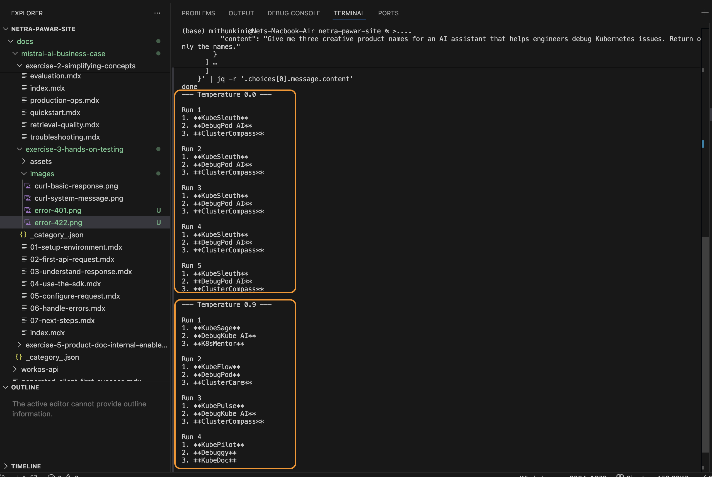

# Configure Your Request

So far, we have only passed the `model` and `messages` parameters. However, the Mistral API exposes several parameters that allow you to control the length, randomness, and format of the model's output.

This page serves as a reference for the most commonly used configuration parameters.

## Parameter Reference

| Parameter | Type | Default | Description | Example |
|-----------|------|---------|-------------|---------|
| `model` | string | — (Required) | The ID of the model to use. | `"mistral-small-latest"` |
| `messages` | array | — (Required) | The conversation history. Must contain at least one user message. | `[{"role": "user", "content": "Hi"}]` |
| `temperature` | number | `0.7` | Controls randomness. Lower values (e.g., `0.2`) make the output more focused and deterministic. Higher values (e.g., `0.8`) make it more creative. Range: `0.0` to `1.5`. | `0.2` |
| `max_tokens` | integer | `null` | The maximum number of tokens to generate in the completion. If `null`, the model will generate until it naturally stops or hits the context window limit. | `500` |
| `top_p` | number | `1.0` | An alternative to temperature, called nucleus sampling. The model considers the results of the tokens with `top_p` probability mass. | `0.9` |
| `safe_prompt` | boolean | `false` | Whether to inject a safety prompt before all conversations to enforce guardrails. | `true` |
| `random_seed` | integer | `null` | The seed to use for random sampling. If set, different calls will generate deterministic results. | `42` |

> **⚠️ Caveat: Temperature vs. Top_P**
> It is highly recommended that you alter either `temperature` OR `top_p`, but not both simultaneously. Changing both makes it very difficult to predict how the model's output distribution will change.

## Try It Yourself: Temperature

Let's see how `temperature` affects the output. A temperature of `0.0` is nearly deterministic (it will give the same answer every time), while `1.0` is highly creative.

```python
# Low Temperature (Factual/Deterministic)
response = client.chat.complete(
    model="mistral-small-latest",
    temperature=0.0,
    messages=[{"role": "user", "content": "Name three colors."}]
)
# Output: Red, Blue, Green.

# High Temperature (Creative)
response = client.chat.complete(
    model="mistral-small-latest",
    temperature=1.0,
    messages=[{"role": "user", "content": "Name three colors."}]
)
# Output: Cerulean, Crimson, Chartreuse.
```


*(Screenshot: Comparing outputs with different temperature settings)*

## Advanced Parameters

The following parameters are used for advanced use cases and are covered in detail in their respective guides:

- **`response_format`:** Forces the model to output a specific format, such as a JSON object. See the [Structured Output](../structured-output) guide.
- **`tools`:** A list of functions the model may call. See the [Function Calling](../function-calling) guide.
- **`tool_choice`:** Controls how the model decides whether to call a tool. Can be `"auto"`, `"any"`, or `"none"`.

---

**Next Step:** Even perfectly configured requests sometimes fail. Learn how to [Handle Errors](./06-handle-errors.mdx) gracefully.
