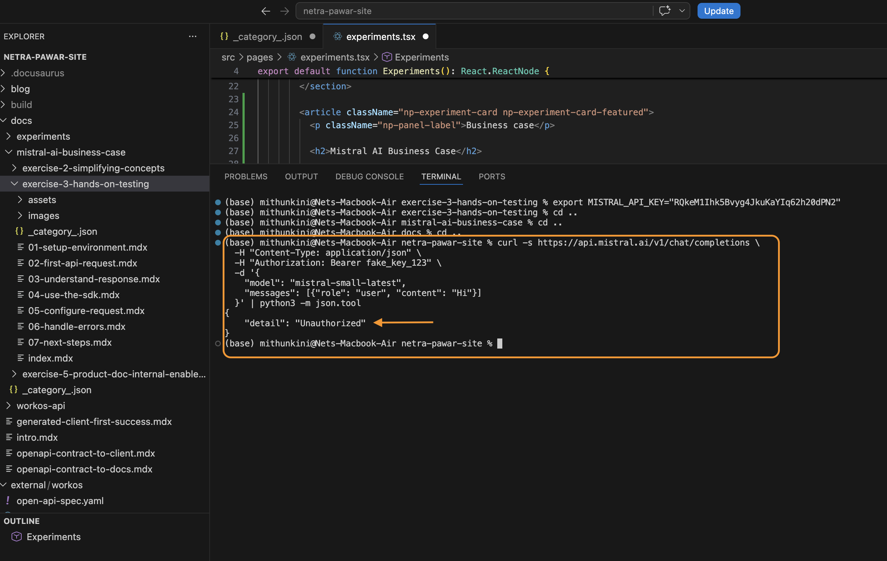
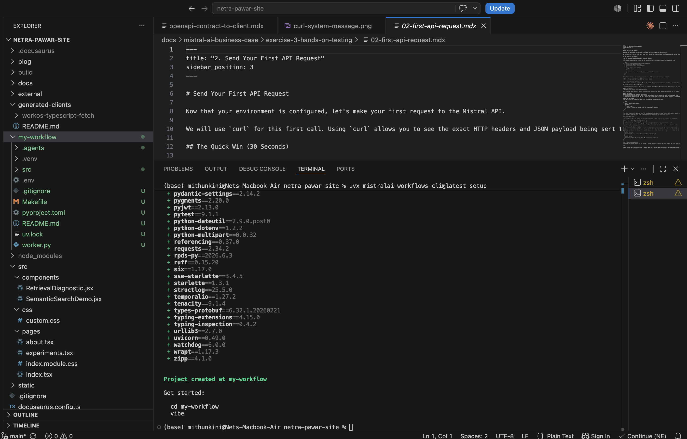

# Handle Errors

When building production applications, you must account for API failures. Mistral uses standard HTTP status codes to indicate the success or failure of an API request.

This page outlines the most common errors you will encounter and how to fix them.

## Common HTTP Error Codes

| Status Code | Error Type | What it means | How to fix it |
|-------------|------------|---------------|---------------|
| **400** | `Bad Request` | The request was malformed. Usually means a missing required parameter or invalid JSON. | Validate your JSON payload. Ensure `model` and `messages` are present. |
| **401** | `Unauthorized` | Your API key is missing, invalid, or revoked. | Check that your `Authorization` header is formatted exactly as `Bearer YOUR_KEY`. Verify the key hasn't been deleted in the console. |
| **404** | `Not Found` | The requested endpoint or model does not exist. | Check for typos in the URL. If you are getting this on a valid URL, check that you haven't misspelled the `model` name (e.g., `mistral-smal` instead of `mistral-small-latest`). |
| **422** | `Unprocessable Entity` | The JSON is valid, but a parameter value violates a constraint. | Check the parameter table. Did you send a string when an integer was expected? Did you set `temperature` to 2.0 (max is 1.5)? |
| **429** | `Too Many Requests` | You have hit a rate limit. | See the "Understanding Rate Limits" section below. |
| **500** | `Internal Server Error` | Mistral's servers encountered an unexpected issue. | Implement exponential backoff and retry the request. |

## Seeing Errors in Action

If you want to see what an error looks like, you can intentionally trigger one. 

Here is a curl command that intentionally uses an invalid API key to trigger a `401 Unauthorized` error:

```bash
curl -X POST https://api.mistral.ai/v1/chat/completions \
  -H "Content-Type: application/json" \
  -H "Authorization: Bearer fake_key_123" \
  -d '{
    "model": "mistral-small-latest",
    "messages": [{"role": "user", "content": "Hi"}]
  }'
```

The response will look like this:
```json
{
  "message":"Unauthorized",
  "request_id":"req_7b8f9c0d1e2f3a4b5c6d7e8f9a0b1c2d"
}
```


*(Screenshot: Triggering a 401 error in the terminal)*

## Understanding Rate Limits (429)

A `429 Too Many Requests` error occurs when you exceed the usage limits associated with your account tier. 

> **⚠️ Caveat: Concurrency vs. Quota**
> A 429 error does not always mean you have run out of monthly tokens. It can also mean you are sending too many requests at the exact same time.

There are two types of limits:
1. **Requests Per Second (RPS):** How many concurrent API calls you can make. (Free tier is limited to 1 RPS).
2. **Tokens Per Month (TPM):** Your total billing quota for the month.

If you hit an RPS limit, your application should catch the 429 error, wait a short period (e.g., 1-2 seconds), and retry the request. If you hit a TPM limit, retrying will not work; you must upgrade your tier or wait for the next billing cycle.


*(Screenshot: Triggering a 429 rate limit error)*

## Debugging Checklist

If your request is failing and the error message isn't clear, run through this checklist:

1. **Did the environment variable load?** 
   Run `echo $MISTRAL_API_KEY` in your terminal. If it's blank, your script isn't picking it up.
2. **Is the JSON valid?**
   If using `curl`, ensure you aren't using unescaped single quotes inside your `-d` payload.
3. **Are you waiting too long? (Timeouts)**
   If you set `max_tokens` to a very high number (e.g., 4000), the model may take 20-30 seconds to generate the full response. Your HTTP client might time out before Mistral finishes. If this happens, either increase your client's timeout setting or switch to **streaming**.

---

**Next Step:** You've mastered the basics. See [Next Steps](./07-next-steps.mdx) to discover what else you can build with Mistral.
